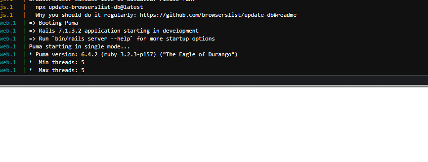
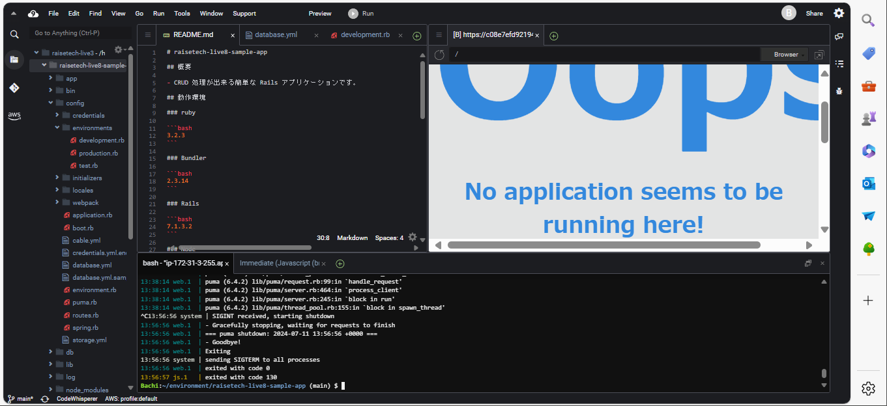
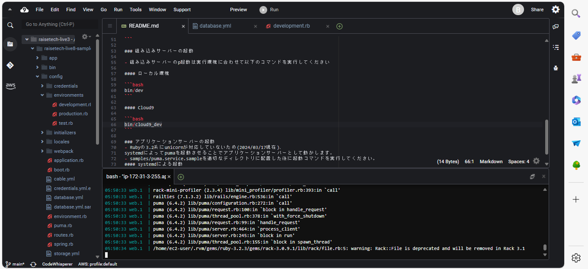
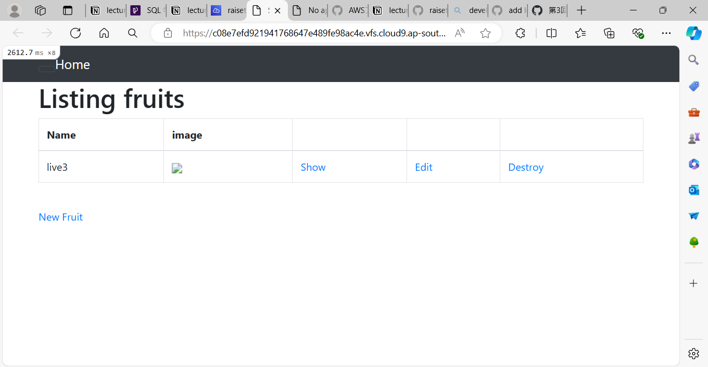

# 第3回課題への取り組み

## 課題提出

- 今回の課題から学んだこと、感じたこと

第二回課題提出からかなり期間が開いてしまったため、Githubへのプッシュ方法が曖昧となってしまっていた。

・Markdawnnでの画像挿入に苦戦しました。

1.ローカルのリポジトリ名をリモートのものとは別で作らなければいけなかった。
lecture03　→　fix/lecture03　/　lecture03

2.git remote -vで確認したところ、おそらくデフォルトで保存されているであろうoriginが設定されていなかった。
　→git remote add origin "URL"で保存しなおしました。
※おそらく"git init"？でリポジトリを初期化したままにしたせい

↓origin設定後

３.おそらくここでgit pullが可能になったのか...?
or " git pull origin lecture03 --rebase"でローカルリポジトリ"fix/lecture03"がリモートリポジトリとのズレがなくなった。（最新に更新できた）

↓メールアドレス設定によるエラー発生

4.git config --global user.email "メールアドレス"で、Githubのメールアドレスを設定し直しました。

5."git push origin fix/lecture03:lecture03"で、無事pushしたいフォルダのみを反映できました。
　→"git push <リモート名（リモートリポジトリの場所）> <ローカルブランチ名>:<リモートブランチ名>"を指定する。
